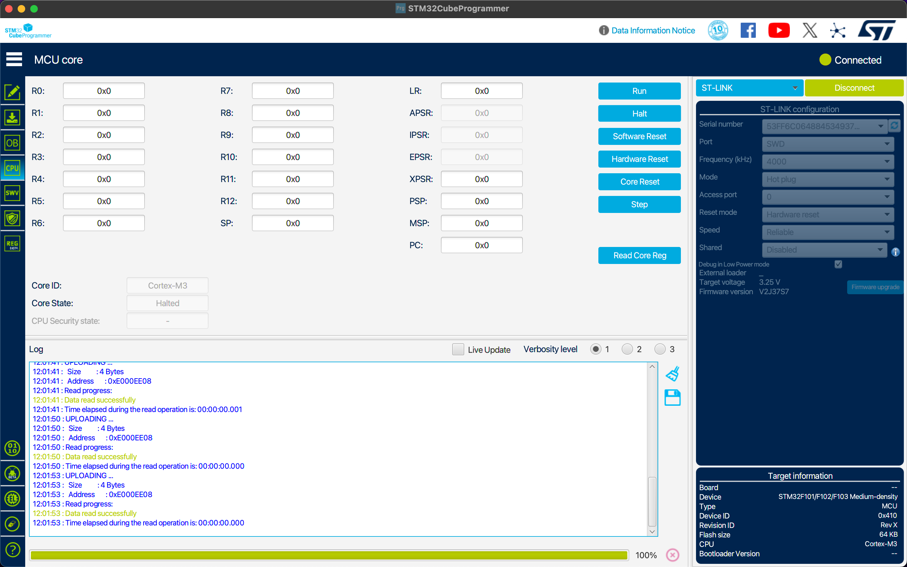
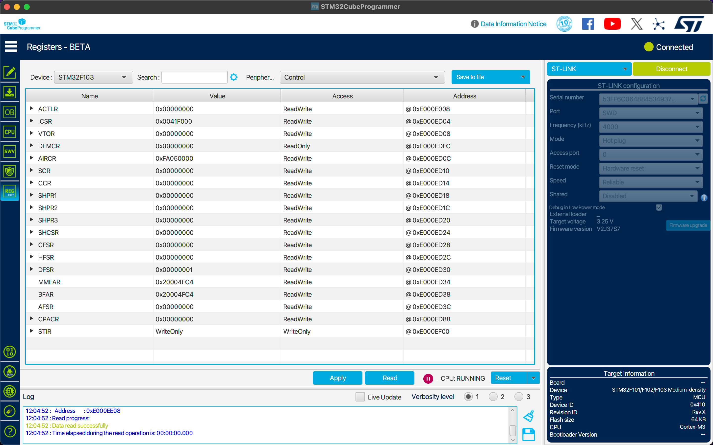
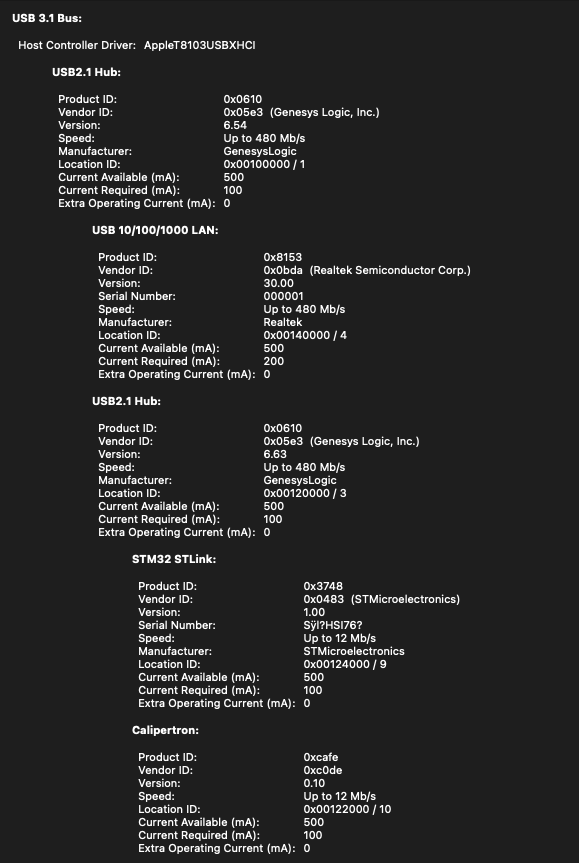

# Minimal reproduction of a Rust Embassy DMA / USB / ADC bug.

This is a minimal reproduction of a bug that manifests as a hanging stm32f103 MCU.
This repro can be run on a "blue pill" breakout board.

The hang is not deterministic, but usually occurs within about 30 seconds of starting the "frontend" program below.

The hang seems to require *all* of the following:

- a timer-driven circular DMA write (both memory to GPIO BSRR register and memory-to-memory hang.)
- circular DMA from ADC to memory

## How to reproduce

First [install Rust](https://www.rust-lang.org/tools/install), then:

    cargo install probe-rs-tools

Then build and flash firmware:

    cd firmware/
    cargo run --release

Then run the USB frontend, which prints ADC readings and sends command messages over USB:

    cd frontend/
    cargo run --release

## Observations

All columns in following table have:

- two 30 second observations (if freeze not seen in first 30 seconds)
- USB and device power cycled after flashing and first negative observation
- debugger disconnected

|                            |   |   |   |   |   |
|----------------------------|---|---|---|---|---|
| timer-driven DMA           | x | x |   | x | x |
| ADC DMA                    | x | x | x |   | x |
| host writing USB           | x |   |   |   |   |
| firmware reading USB       | x | x | x | x |   |
|----------------------------|---|---|---|---|---|
| Freeze observed within 30s | x | x |   |   |   |

When using the STM32CubeProgrammer to "hot plug" connect to a frozen device, all of the CPU registers are borked. In this screenshot they're all 0, but I've also seen them all be 0x2100_0000:

I don't see any obvious error flags in the status registers called out by Memfault's great [How to debug a HardFault on an ARM Cortex-M MCU](https://interrupt.memfault.com/blog/cortex-m-hardfault-debug#determining-what-caused-the-fault) post:

Feel free to look at [all_registers.txt](all_registers.txt) for the full dump of a frozen state.

Everything was compiled and the data above collected via:

- M1 MacBook Air
- MacOS 12.7.2
- USBC port -> HDMI + USB A female + USB C power input dongle (unknown) -> [4-port Sabrent USB Hub](https://www.amazon.nl/-/en/gp/product/B00JX1ZS5O/) -> ST Link v2 and board's USB receptacle connected to STM32 pins.

## Hypotheses

- Is your specific board / chip cursed? No, I was able to repro the freeze on an stm32f103 "blue pill" dev board I had laying around, and the bug has been reproduced by another developer with their own hardware.

- Is it a hard fault? I don't think so, as the CPU never jumps to the installed handler (which just infinite loops).

- Is the stm32f103 chip cursed? I looked through the [device errata](https://www.st.com/resource/en/errata_sheet/es0340-stm32f101xcde-stm32f103xcde-device-errata-stmicroelectronics.pdf), didn't see anything jump out.

- (From my friend Jeff, who has reproduced the issue): There's [some kind of bus contention when device enters sleep](https://github.com/lynaghk/repro-stm32f103-rust-embassy-freeze/issues/1).
